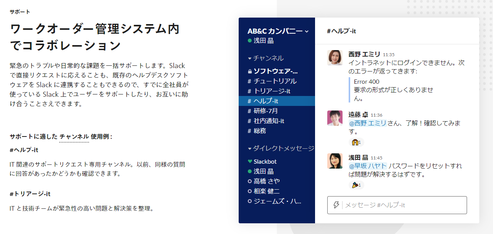

## よくある Slack 問い合わせ対応チャンネル運用

こんな感じの専用チャンネルが存在し、従業員から問い合わせが順次飛んでくる形。

対応チームは以下のような流れで対応する

1. 問い合わせの投稿に対してスレッドで回答
   - 画像と異なりますが、基本的にスレッドでやらないと流れ過ぎます
2. 問い合わせ対応が完了したら、スタンプで終了のマークを付ける
   - これも画像ではやってないですが、ある程度のチームで対応してる場合一般的だと思われます

## 上記運用の問題点

- 問い合わせの対応が長期化した際にスレッドが流れてしまい、未完了の問い合わせが分からなくなってくる
- 問い合わせ対応はもはや業務の大きな一部となっているにも関わらず、対応コストが可視化されにくい

## 改善案
Google Apps Script を使って、